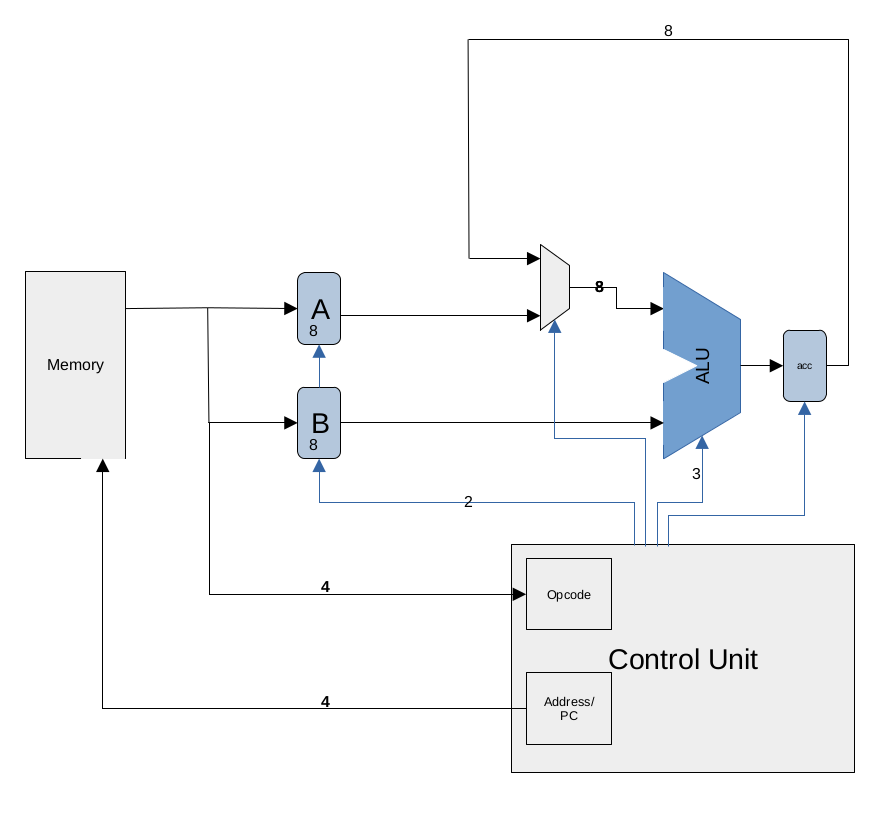
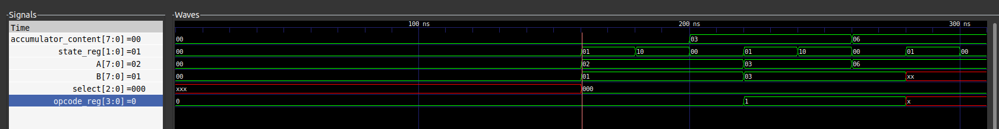

# A simple 8-bit processor implemented in Verilog HDL

The processor is simple and It uses a 5 operation ALU. Using a combination of an accumulator, mux and Control signals;
a total of 9 instructions are supported.

## Features

- ✅ 20-bit instruction with 4 bit opcode and two 8 bit operands
- ✅ Only 9 instruction
- ✅ Program counter to execute instruction sequentially
- ✅ Two different type of instruction: One that works on both operand and another that uses one of the operand and the accumulator
- ✅ Results of all the operation are stored in the accumulator

## Cpu Architecture

## Cpu Waveform/Timing analysis

